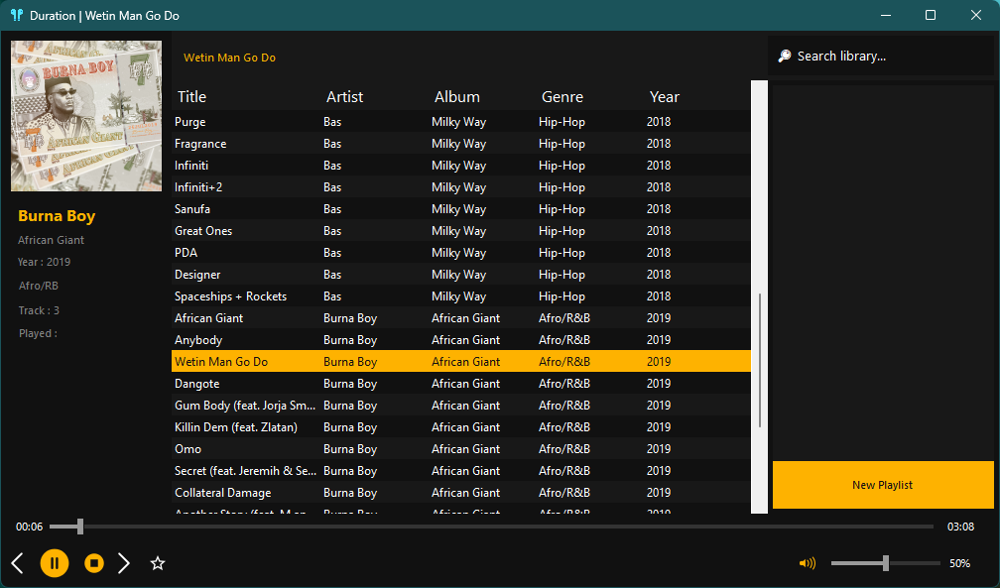
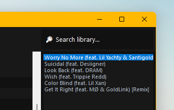

# Duration 1.2

This is a media player with simple functionality to get you listening to your favourite song.
No fuss, no distractions, just select a folder of your music and let it play through it all.

## Fixes & Bugs

- Library and playlist play music seperately and allow using the same previous and next button
- Player now able to store library songs
- Player will start playing from the first song when using the data grid 

## Updates

- Users can scrub through the song to choose the right moment or rewind
- Users now have to double click a song in the list to play
- The UI is now optimised for slower systems

## Home Page

The main page features an area where the album artwork is displayed followed by a list of current playing items and some controls.
Users are free to experiment with the interface and see how it reacts.

## Search

Users are able to search for the name of a song depending on its title through the search bar onto of the recents list. Note that 
after a song is highlighted, you'd have to double click it to let it play, which is a bad thing.

## Library

This page will host all your saved music, at the mean time it's not fully functional and is in development, it will be one of the 
best features of the application because applications that remeber state are regarded as intelligent in the modern day.

## Visualize

This is a feature that enables the visual effect which comes with Windows media player legacy as the song plays and also responds 
to the tones in the song thats playing.

## Screen economy

This is how much of the player takes on your screen leaving space for other applications to function.  
In the later builds, the player will manage its functions without intruding on other applications.

